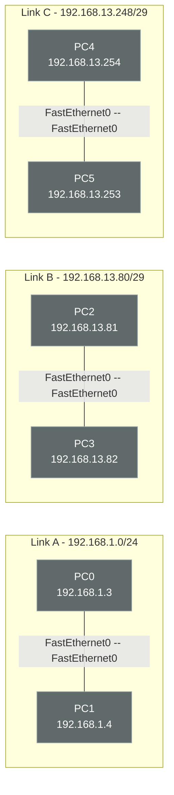

## ex01 

### PC Configuration for ex01
- **PC0**: IP Address `192.168.1.3`, Subnet Mask `255.255.255.0`
- **PC1**: IP Address `192.168.1.4`, Subnet Mask `255.255.255.0`
- **PC2**: IP Address `192.168.13.81`, Subnet Mask `255.255.255.248`
- **PC3**: IP Address `192.168.13.82`, Subnet Mask `255.255.255.248`
- **PC4**: IP Address `192.168.13.254`, Subnet Mask `255.255.255.248`
- **PC5**: IP Address `192.168.13.253`, Subnet Mask `255.255.255.248`

| Link | Subnet | Hosts |
|---|---|---|
| PC0–PC1 | 192.168.1.0/24 | .3, .4 |
| PC2–PC3 | 192.168.13.80/29 | .81, .82 |
| PC4–PC5 | 192.168.13.248/29 | .253, .254 |

## ex02

### Switch Subnet (192.168.1.0/29)
All devices connected to the switch must communicate with each other. The image displays S-PC5 with `192.168.1.5/29`.
- **Subnet Address:** `192.168.1.0`
- **Subnet Mask:** `255.255.255.248`
- **S-PC1:** IP Address `192.168.1.1`
- **S-PC2:** IP Address `192.168.1.2`
- **S-PC3:** IP Address `192.168.1.3`
- **S-PC4:** IP Address `192.168.1.4`
- **S-PC5:** IP Address `192.168.1.5`

### Hub Subnet (192.168.1.192/27)
All devices connected to the hub must communicate with each other. The image displays H-PC1 with `192.168.1.193/27`.
- **Subnet Address:** `192.168.1.192`
- **Subnet Mask:** `255.255.255.224`
- **H-PC1:** IP Address `192.168.1.193`
- **H-PC2:** IP Address `192.168.1.194`
- **H-PC3:** IP Address `192.168.1.195`
- **H-PC4:** IP Address `192.168.1.196`
- **H-PC5:** IP Address `192.168.1.197`

## ex03

All devices are part of a common network with a single switch.

### Server Configurations (Static IP, /24 Subnet)
- **HTTPS SERVER:** IP Address `192.168.1.99`, Subnet Mask `255.255.255.0`
  - *Config:* HTTP disabled, HTTPS enabled (Displays a Hello Message).
- **FTP SERVER:** IP Address `192.168.1.100`, Subnet Mask `255.255.255.0`
  - *Config:* Account `deepinnet` with `RWDNL` access permissions.
- **DNS SERVER:** IP Address `192.168.1.101`, Subnet Mask `255.255.255.0`
  - *Config (Records):* `deep-in-net.local > 192.168.1.99`, `deep-in-net.com > deep-in-net.local` (ensures `https://deep-in-net.com` redirects to HTTPS Server).
- **DHCP SERVER:** IP Address `192.168.1.102` (or another static IP in the subnet), Subnet Mask `255.255.255.0`
  - *Config:* Serves the `192.168.1.0/24` subnet. Ensure the IP pool avoids the static IPs of the servers.

### Client Configurations (DHCP)
- **PC0 - PC5:** Set to receive IP addresses dynamically from the DHCP SERVER. The image indicates PC5 received `192.168.1.7/24`.
