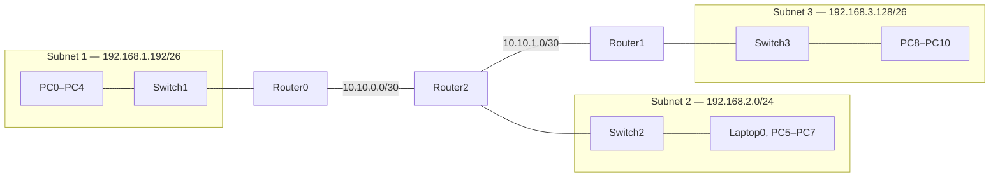

# deep-in-net

Eight Cisco Packet Tracer exercises covering Ethernet cabling, hubs and switches,
network services, subnetting, default gateways, routers, and static routing.

## Project files and verification

The configurations documented here were read directly from `ex01.pkt` through
`ex08.pkt` (Packet Tracer 8.2.2/9.0.1 format) and checked against `subject.md` and
`audit.md`. No Packet Tracer file was modified while preparing this documentation.

| Exercise | Main topic | Saved topology |
|---|---|---|
| 01 | Direct Ethernet links and cable types | 6 PCs, 3 isolated links |
| 02 | Hub versus switch | 5 switch clients, 5 hub clients |
| 03 | DHCP, DNS, HTTPS, and FTP | 4 servers, 6 DHCP clients, 1 switch |
| 04 | Default gateways and directly connected routing | 1 router, 2 PCs |
| 05 | Subnetting through one router | 1 router, 2 switches, 10 PCs |
| 06 | Two-router static routing | 2 routers, 2 PCs |
| 07 | Two routed switched LANs | 2 routers, 2 switches, 9 clients |
| 08 | Three LANs and multi-hop static routing | 3 routers, 3 switches, 12 clients |

### Important findings in the saved files

The README reports saved data honestly. These differences should be fixed in
Packet Tracer before a final audit if the affected exercise must pass its
connectivity checks.

| Exercise | Finding | Correct working value |
|---|---|---|
| 01 | PC4 and PC5 are saved with `/28`; the old README described `/29`. | Keep the documented `/28` values unless the exercise image explicitly requires `/29` and the `.pkt` is updated. |
| 02 | The switch LAN is saved as `192.168.1.0/28`, not `/29`. | The five saved clients are valid in `/28`. |
| 05 | PC5-PC9 use `192.168.1.1` as their gateway, which is outside their `/27`. | Use `192.168.1.193`, Router1's interface in `192.168.1.192/27`. |
| 06 | PC0 is saved as `192.168.1.2/24` with gateway `10.10.0.1`; neither matches its local router link. | Use `192.168.1.2/30` and gateway `192.168.1.1`. The precise return route is `192.168.1.0/30`. |
| 08 | Required LAN routes and addresses match the requested design. Optional serial-network routes are not saved. | Add the optional routes only if every router interface must be reachable. |

## Exercise 1 — Direct PC-to-PC links

Three independent pairs of PCs communicate without an intermediate device. A
direct connection traditionally uses a crossover Ethernet cable because both
ends are the same device type.

| Link | Device | IPv4 address | Mask | Network | Broadcast | Gateway |
|---|---|---:|---:|---:|---:|---:|
| A | PC0 | `192.168.1.3` | `255.255.255.0` (`/24`) | `192.168.1.0` | `192.168.1.255` | None |
| A | PC1 | `192.168.1.4` | `255.255.255.0` (`/24`) | `192.168.1.0` | `192.168.1.255` | None |
| B | PC2 | `192.168.13.81` | `255.255.255.248` (`/29`) | `192.168.13.80` | `192.168.13.87` | None |
| B | PC3 | `192.168.13.82` | `255.255.255.248` (`/29`) | `192.168.13.80` | `192.168.13.87` | None |
| C | PC4 | `192.168.13.254` | `255.255.255.240` (`/28`) | `192.168.13.240` | `192.168.13.255` | None |
| C | PC5 | `192.168.13.253` | `255.255.255.240` (`/28`) | `192.168.13.240` | `192.168.13.255` | None |

No default gateway is required because communication never leaves a local link.

- **RJ-45** commonly refers to the eight-position modular connector used with
  twisted-pair Ethernet cable.
- A **straight-through** cable uses the same pin standard at both ends and is
  traditionally used between unlike devices, such as a PC and switch.
- A **crossover** cable swaps transmit and receive pairs and is traditionally
  used between like devices, such as PC-to-PC or switch-to-switch.

Test `PC0 ↔ PC1`, `PC2 ↔ PC3`, and `PC4 ↔ PC5` with `ping`.

## Exercise 2 — Switch and hub

| Segment | Device | IPv4 address | Mask | Gateway |
|---|---|---:|---:|---:|
| Switch1 | PC0 | `192.168.1.9` | `255.255.255.240` (`/28`) | None |
| Switch1 | PC1 | `192.168.1.8` | `255.255.255.240` (`/28`) | None |
| Switch1 | PC2 | `192.168.1.7` | `255.255.255.240` (`/28`) | None |
| Switch1 | PC3 | `192.168.1.6` | `255.255.255.240` (`/28`) | None |
| Switch1 | PC4 | `192.168.1.5` | `255.255.255.240` (`/28`) | None |
| Hub0 | PC5 | `192.168.1.193` | `255.255.255.224` (`/27`) | None |
| Hub0 | PC6 | `192.168.1.194` | `255.255.255.224` (`/27`) | None |
| Hub0 | PC7 | `192.168.1.195` | `255.255.255.224` (`/27`) | None |
| Hub0 | PC8 | `192.168.1.196` | `255.255.255.224` (`/27`) | None |
| Hub0 | PC9 | `192.168.1.197` | `255.255.255.224` (`/27`) | None |

The switch segment is `192.168.1.0/28` (usable `.1-.14`, broadcast `.15`).
The hub segment is `192.168.1.192/27` (usable `.193-.222`, broadcast `.223`).
They are separate LANs and have no router between them, so only hosts within the
same segment are expected to communicate.

A hub is a Layer 1 repeater: incoming bits are repeated to every other port. All
attached devices share bandwidth and one collision domain. A Layer 2 switch
learns source MAC addresses and builds a MAC/CAM table; it normally forwards a
unicast frame only through the destination's port. Each switch port is a separate
collision domain, although the access ports remain in one broadcast domain
unless VLANs are used.

## Exercise 3 — Network services

All devices connect to Switch0 on `192.168.1.0/24`. There is no router, so a
default gateway is unnecessary for the required local services.

### Static server addressing

| Server | Address | Mask | Enabled role |
|---|---:|---:|---|
| HTTPS SERVER | `192.168.1.99` | `255.255.255.0` | HTTPS enabled; HTTP disabled; page contains “Hello Student” |
| FTP SERVER | `192.168.1.100` | `255.255.255.0` | FTP enabled; `deepinnet` has `RWDNL` permissions |
| DNS SERVER | `192.168.1.101` | `255.255.255.0` | DNS enabled |
| DHCP SERVER | `192.168.1.102` | `255.255.255.0` | DHCP enabled |

The DHCP `serverPool` uses network `192.168.1.0/24`, start address
`192.168.1.2`, DNS server `192.168.1.101`, and no default router (`0.0.0.0`).
The pool currently says its end address is `.255`; in a production design the
broadcast address and static server range should be excluded explicitly.

| Client | Assignment | Saved lease | Mask | DNS | Gateway |
|---|---|---:|---:|---:|---:|
| PC0 | DHCP | `192.168.1.6` | `255.255.255.0` | `192.168.1.101` | None |
| PC1 | DHCP | `192.168.1.2` | `255.255.255.0` | `192.168.1.101` | None |
| PC2 | DHCP | `192.168.1.3` | `255.255.255.0` | `192.168.1.101` | None |
| PC3 | DHCP | `192.168.1.5` | `255.255.255.0` | `192.168.1.101` | None |
| PC4 | DHCP | `192.168.1.7` | `255.255.255.0` | `192.168.1.101` | None |
| PC5 | DHCP | `192.168.1.4` | `255.255.255.0` | `192.168.1.101` | None |

DHCP leases can change after release/renew. The DNS server has these saved records:

| Type | Name | Value |
|---|---|---|
| A | `deep-in-net.local` | `192.168.1.99` |
| CNAME | `deep-in-net.com` | `deep-in-net.local` |

Browse to `https://deep-in-net.com`, verify the HTTPS page, and confirm HTTP is
disabled. Connect to `192.168.1.100` by FTP with `deepinnet` and verify its read,
write, delete, rename, and list access.

| Protocol | Transport and ports | Layer and purpose |
|---|---|---|
| DHCP | UDP 67/68 | Application layer; leases client configuration |
| DNS | UDP/TCP 53 | Application layer; resolves names and aliases |
| HTTP | TCP 80 | Application layer; unencrypted web traffic |
| HTTPS | TCP 443 | Application layer; HTTP protected by TLS |
| FTP | TCP 21 control, TCP 20 active data | Application layer; file transfer |
| TCP | IP protocol 6 | Transport layer; connection-oriented and reliable |
| UDP | IP protocol 17 | Transport layer; connectionless and low-overhead |

A port number identifies a service endpoint at the transport layer. TCP adds
sequencing, acknowledgements, retransmission, and flow control; UDP does not.

## Exercise 4 — One router and two subnets

Router0 connects two `/30` LANs and automatically installs both as directly
connected routes.

| Device | Interface | IPv4 address | Mask | Default gateway |
|---|---|---:|---:|---:|
| Router0 | FastEthernet0/0 | `192.168.1.1` | `255.255.255.252` | — |
| PC0 | FastEthernet0 | `192.168.1.2` | `255.255.255.252` | `192.168.1.1` |
| Router0 | FastEthernet0/1 | `192.168.2.1` | `255.255.255.252` | — |
| PC1 | FastEthernet0 | `192.168.2.2` | `255.255.255.252` | `192.168.2.1` |

The networks are `192.168.1.0/30` and `192.168.2.0/30`; each has two usable
addresses. A router works mainly at OSI Layer 3, chooses a next hop from its
routing table, and separates broadcast domains. A default gateway is the local
router address to which a host sends remote traffic.

## Exercise 5 — Two switched subnets through one router

| LAN | Network | Usable range | Broadcast | Router1 interface |
|---|---|---|---|---|
| Subnet 1 | `192.168.1.0/29` | `192.168.1.1-192.168.1.6` | `192.168.1.7` | G0/0 `192.168.1.1` |
| Subnet 2 | `192.168.1.192/27` | `192.168.1.193-192.168.1.222` | `192.168.1.223` | G0/1 `192.168.1.193` |

No static routes are needed because both networks are directly connected.

| LAN | Device | IPv4 address | Mask | Gateway saved | Working gateway |
|---|---|---:|---:|---:|---:|
| Subnet 1 | PC0 | `192.168.1.5` | `255.255.255.248` | `192.168.1.1` | `192.168.1.1` |
| Subnet 1 | PC1 | `192.168.1.4` | `255.255.255.248` | `192.168.1.1` | `192.168.1.1` |
| Subnet 1 | PC2 | `192.168.1.3` | `255.255.255.248` | `192.168.1.1` | `192.168.1.1` |
| Subnet 1 | PC3 | `192.168.1.2` | `255.255.255.248` | `192.168.1.1` | `192.168.1.1` |
| Subnet 1 | PC4 | `192.168.1.6` | `255.255.255.248` | `192.168.1.1` | `192.168.1.1` |
| Subnet 2 | PC5 | `192.168.1.194` | `255.255.255.224` | **`192.168.1.1`** | **`192.168.1.193`** |
| Subnet 2 | PC6 | `192.168.1.195` | `255.255.255.224` | **`192.168.1.1`** | **`192.168.1.193`** |
| Subnet 2 | PC7 | `192.168.1.196` | `255.255.255.224` | **`192.168.1.1`** | **`192.168.1.193`** |
| Subnet 2 | PC8 | `192.168.1.197` | `255.255.255.224` | **`192.168.1.1`** | **`192.168.1.193`** |
| Subnet 2 | PC9 | `192.168.1.198` | `255.255.255.224` | **`192.168.1.1`** | **`192.168.1.193`** |

The saved Subnet 2 gateway is outside that `/27`; change it to
`192.168.1.193` for inter-subnet communication.

## Exercise 6 — Static routing between two routers

| Router | Interface | Address | Mask | Connected network |
|---|---|---:|---:|---:|
| Router0 | FastEthernet0/0 | `192.168.1.1` | `255.255.255.252` | `192.168.1.0/30` |
| Router0 | Serial2/0 | `10.10.0.1` | `255.255.255.252` | `10.10.0.0/30` |
| Router1 | Serial2/0 | `10.10.0.2` | `255.255.255.252` | `10.10.0.0/30` |
| Router1 | FastEthernet0/0 | `192.168.2.1` | `255.255.255.0` | `192.168.2.0/24` |

| Router | Destination | Mask | Next hop | Note |
|---|---:|---:|---:|---|
| Router0 | `192.168.2.0` | `255.255.255.0` | `10.10.0.2` | Correct |
| Router1 | `192.168.1.0` | `255.255.255.0` | `10.10.0.1` | Saved route is broad; `/30` is precise |

| Device | Saved IP/mask | Saved gateway | Correct working configuration |
|---|---|---:|---|
| PC0 | `192.168.1.2/24` | `10.10.0.1` | `192.168.1.2/30`, gateway `192.168.1.1` |
| PC1 | `192.168.2.2/24` | `192.168.2.1` | Already correct |

A routing table contains connected, static, and possibly dynamically learned
paths. A router uses the most specific matching prefix. Both a forward route and
a return route are required.

## Exercise 7 — Two complete LANs

| Router | Interface | Address | Mask |
|---|---|---:|---:|
| Router0 | FastEthernet0/0 | `192.168.1.1` | `255.255.255.0` |
| Router0 | Serial2/0 | `10.10.0.1` | `255.255.255.252` |
| Router1 | Serial2/0 | `10.10.0.2` | `255.255.255.252` |
| Router1 | FastEthernet0/0 | `192.168.2.1` | `255.255.255.0` |

| Router | Destination | Mask | Next hop |
|---|---:|---:|---:|
| Router0 | `192.168.2.0` | `255.255.255.0` | `10.10.0.2` |
| Router1 | `192.168.1.0` | `255.255.255.0` | `10.10.0.1` |

| LAN | Device | IPv4 address | Mask | Default gateway |
|---|---|---:|---:|---:|
| Subnet 1 | PC0 | `192.168.1.2` | `255.255.255.0` | `192.168.1.1` |
| Subnet 1 | PC1 | `192.168.1.3` | `255.255.255.0` | `192.168.1.1` |
| Subnet 1 | PC2 | `192.168.1.4` | `255.255.255.0` | `192.168.1.1` |
| Subnet 1 | PC3 | `192.168.1.5` | `255.255.255.0` | `192.168.1.1` |
| Subnet 1 | PC4 | `192.168.1.6` | `255.255.255.0` | `192.168.1.1` |
| Subnet 2 | Laptop0 | `192.168.2.2` | `255.255.255.0` | `192.168.2.1` |
| Subnet 2 | PC5 | `192.168.2.3` | `255.255.255.0` | `192.168.2.1` |
| Subnet 2 | PC6 | `192.168.2.4` | `255.255.255.0` | `192.168.2.1` |
| Subnet 2 | PC7 | `192.168.2.5` | `255.255.255.0` | `192.168.2.1` |

Test within each switch, then in both directions across the serial link. The
audit may ask the learner to recreate this network without external tools.

## Exercise 8 — Three LANs with static routing

### Objective

Exercise 8 connects three separate LANs through three routers using static
routing. Router2 is the transit router between Router0 and Router1. Every PC and
laptop must communicate with hosts in both other subnets.

### Topology

Router0 connects to Router2; Router2 connects to Router0 and Router1; Router1
connects to Router2. Each router also connects to its own switch and LAN.

### IPv4 subnet calculations

| Segment | Prefix | Mask | First usable | Last usable | Broadcast |
|---|---:|---:|---:|---:|---:|
| Subnet 1 | `192.168.1.192/26` | `255.255.255.192` | `192.168.1.193` | `192.168.1.254` | `192.168.1.255` |
| Subnet 2 | `192.168.2.0/24` | `255.255.255.0` | `192.168.2.1` | `192.168.2.254` | `192.168.2.255` |
| Subnet 3 | `192.168.3.128/26` | `255.255.255.192` | `192.168.3.129` | `192.168.3.190` | `192.168.3.191` |
| Router0–Router2 | `10.10.0.0/30` | `255.255.255.252` | `10.10.0.1` | `10.10.0.2` | `10.10.0.3` |
| Router2–Router1 | `10.10.1.0/30` | `255.255.255.252` | `10.10.1.1` | `10.10.1.2` | `10.10.1.3` |

A `/30` has four total addresses: one network, two usable hosts, and one
broadcast. It exactly fits two router interfaces on a point-to-point link.

### Router interface configuration

| Router | Interface | IPv4 address | Prefix | Mask | Link |
|---|---|---:|---:|---:|---|
| Router0 | FastEthernet0/0 | `192.168.1.193` | `/26` | `255.255.255.192` | Subnet 1 gateway |
| Router0 | Serial2/0 | `10.10.0.1` | `/30` | `255.255.255.252` | Router0–Router2 |
| Router2 | FastEthernet0/0 | `192.168.2.1` | `/24` | `255.255.255.0` | Subnet 2 gateway |
| Router2 | Serial2/0 | `10.10.0.2` | `/30` | `255.255.255.252` | Router2–Router0 |
| Router2 | Serial3/0 | `10.10.1.1` | `/30` | `255.255.255.252` | Router2–Router1 |
| Router1 | FastEthernet0/0 | `192.168.3.129` | `/26` | `255.255.255.192` | Subnet 3 gateway |
| Router1 | Serial2/0 | `10.10.1.2` | `/30` | `255.255.255.252` | Router1–Router2 |

All seven interfaces are enabled. Router0 supplies clocking on `10.10.0.0/30`;
Router2 supplies it on `10.10.1.0/30`, both at 2,000,000 bps.

### PC and laptop addressing

| Subnet | Device | IPv4 address | Subnet mask | Default gateway |
|---|---|---:|---:|---:|
| 1 | PC0 | `192.168.1.194` | `255.255.255.192` | `192.168.1.193` |
| 1 | PC1 | `192.168.1.195` | `255.255.255.192` | `192.168.1.193` |
| 1 | PC2 | `192.168.1.196` | `255.255.255.192` | `192.168.1.193` |
| 1 | PC3 | `192.168.1.197` | `255.255.255.192` | `192.168.1.193` |
| 1 | PC4 | `192.168.1.198` | `255.255.255.192` | `192.168.1.193` |
| 2 | Laptop0 | `192.168.2.2` | `255.255.255.0` | `192.168.2.1` |
| 2 | PC5 | `192.168.2.3` | `255.255.255.0` | `192.168.2.1` |
| 2 | PC6 | `192.168.2.4` | `255.255.255.0` | `192.168.2.1` |
| 2 | PC7 | `192.168.2.5` | `255.255.255.0` | `192.168.2.1` |
| 3 | PC8 | `192.168.3.164` | `255.255.255.192` | `192.168.3.129` |
| 3 | PC9 | `192.168.3.165` | `255.255.255.192` | `192.168.3.129` |
| 3 | PC10 | `192.168.3.166` | `255.255.255.192` | `192.168.3.129` |

### Static routes saved in `ex08.pkt`

These routes are entered through **Router → Config → Routing → Static**, or with
the equivalent IOS `ip route` command.

| Router | Destination network | Mask | Next hop |
|---|---:|---:|---:|
| Router0 | `192.168.2.0` | `255.255.255.0` | `10.10.0.2` |
| Router0 | `192.168.3.128` | `255.255.255.192` | `10.10.0.2` |
| Router2 | `192.168.1.192` | `255.255.255.192` | `10.10.0.1` |
| Router2 | `192.168.3.128` | `255.255.255.192` | `10.10.1.2` |
| Router1 | `192.168.1.192` | `255.255.255.192` | `10.10.1.1` |
| Router1 | `192.168.2.0` | `255.255.255.0` | `10.10.1.1` |

Routers automatically know their active, directly connected networks. Router0
knows Subnet 1 and `10.10.0.0/30`, but needs routes for LANs 2 and 3. Router1
needs routes for LANs 1 and 2. Router2 knows LAN 2 and both serial networks, but
needs a static route to each edge LAN. A next hop must be a neighboring router
address on a directly connected network.

### Forward and return paths

Subnet 1 to Subnet 3 follows:

`PC in LAN 1 → Router0 → Router2 → Router1 → PC in LAN 3`

The reply follows the reverse path. Successful communication needs Router0's
route toward Subnet 3, Router2's routes toward both edges, Router1's route toward
Subnet 1, and correct gateways at both PCs. A missing return route can allow the
request to arrive while losing the reply.

### Router-interface reachability and optional routes

PC-to-PC communication can work even if Router0 cannot ping Router1's remote
serial address `10.10.1.2`. The required routes cover the user LANs, not the far
transit subnet. To make all router interfaces reachable, add:

| Router | Destination network | Mask | Next hop |
|---|---:|---:|---:|
| Router0 | `10.10.1.0` | `255.255.255.252` | `10.10.0.2` |
| Router1 | `10.10.0.0` | `255.255.255.252` | `10.10.1.1` |

These routes are **not currently present** in `ex08.pkt`; they are optional.
Router2 needs neither because both `/30` networks are directly connected.

### Packet-flow example: PC0 to PC8

1. PC0 compares `192.168.3.164` with its `/26` and recognizes a remote address.
2. PC0 uses ARP for gateway `192.168.1.193` and sends the ICMP Echo Request to Router0.
3. Router0 matches `192.168.3.128/26` via next hop `10.10.0.2`.
4. Router0 forwards the packet over Serial2/0 to Router2.
5. Router2 matches `192.168.3.128/26` via `10.10.1.2` and forwards to Router1.
6. Router1 sees Subnet 3 as directly connected, resolves PC8's MAC if needed,
   and delivers the packet through Switch3.
7. PC8 sends an ICMP Echo Reply to gateway `192.168.3.129`; it returns through
   Router1 → Router2 → Router0 → PC0.

At each routed hop the IP endpoints remain PC0 and PC8, but the Layer 2 framing
is replaced for the next link, and the router reduces the TTL.

### Testing checklist

The first Packet Tracer ping can fail while ARP resolves a next-hop MAC address;
repeat it before diagnosing a fault.

| Test | Example | Expected result |
|---|---|---|
| Inside Subnet 1 | PC0 → PC4 | Success |
| Inside Subnet 2 | Laptop0 → PC7 | Success |
| Inside Subnet 3 | PC8 → PC10 | Success |
| Subnet 1 → Subnet 2 | PC0 → Laptop0 | Success |
| Subnet 1 → Subnet 3 | PC0 → PC8 | Success |
| Subnet 2 → Subnet 3 | PC5 → PC10 | Success |
| Router0 → Router2 | `10.10.0.1` → `10.10.0.2` | Success |
| Router2 → Router1 | `10.10.1.1` → `10.10.1.2` | Success |
| Router0 → Router1 serial | Router0 → `10.10.1.2` | Success after optional routes |

Useful commands are `show ip interface brief`, `show ip route`,
`show running-config`, `show arp`, `ping`, and `traceroute`.

### Common errors

- **Overlapping networks:** router interfaces cannot use the same or overlapping
  IPv4 networks.
- **Incorrect masks:** a host may classify local traffic as remote, or remote
  traffic as local.
- **Missing/off-subnet gateway:** local traffic works but remote traffic fails.
  The gateway must be reachable in the host's own subnet.
- **Wrong next hop:** a static route must point to the adjacent router on a
  directly connected link.
- **Missing return route:** requests travel forward but replies cannot return.
- **Disabled interface:** configure the address and enable it (`no shutdown`);
  the serial DCE end also needs clocking.
- **One subnet on two serial links:** Router2 Serial2/0 and Serial3/0 are
  different Layer 3 links and require separate, non-overlapping `/30` networks.

## General troubleshooting order

1. Confirm power, cable type, ports, and link state.
2. Check every endpoint's IP address, mask, and local gateway.
3. Test a same-LAN peer, then the gateway, then a remote host.
4. Use `show ip interface brief` and confirm router interfaces are up/up.
5. Inspect connected and static routes with `show ip route`.
6. Ping point-to-point neighbors before testing remote LANs.
7. Use `traceroute` to find the hop where forwarding stops.
8. Check the reverse path, ARP table, and application service settings.

## Conclusion

These exercises progress from local Ethernet communication to multi-router
forwarding. They show how masks define network, host, and broadcast addresses;
how a default gateway carries remote traffic; how routers combine connected and
static routes; and why valid next hops and return paths matter. They also show
ARP resolving local neighbors, ICMP testing reachability, switches learning MAC
addresses, and applications using TCP or UDP ports. Exercise 8 combines these
ideas in a three-LAN design with efficient `/30` transit links.
